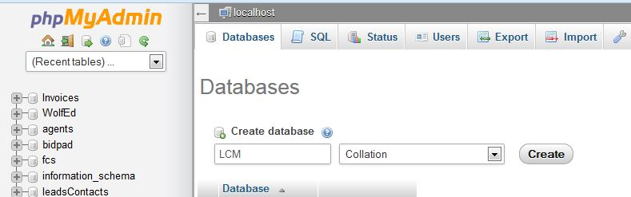
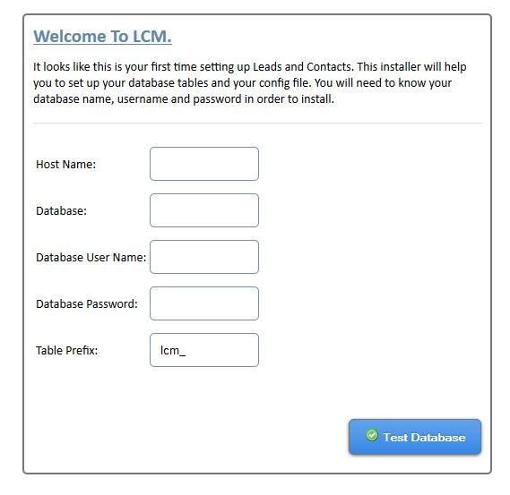
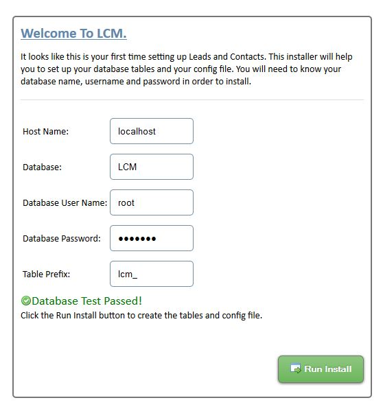
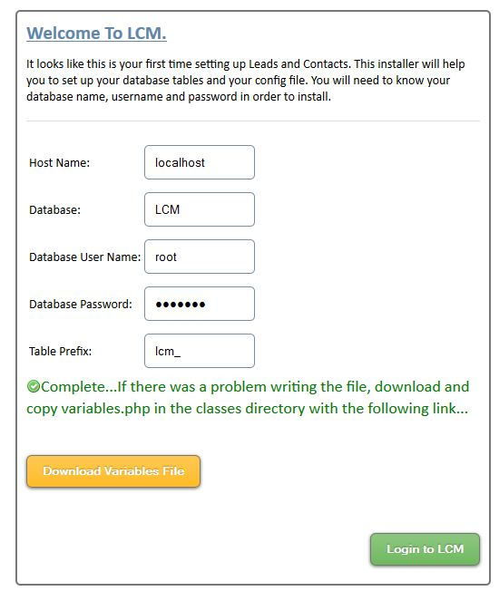
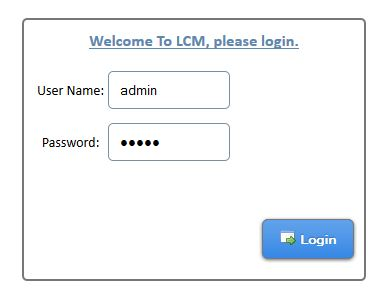

# Leads and Contacts Manager - LCM

---

		
### Description

This application is your very own leads and contacts manager.  This tool allows you to keep track of your leads and / or contacts, organize them by Source, Type, or Status so that you can readily view your contacts and track them.  This system is set up to allow multiple users to manage your leads and contacts.  A log keeps track of detailed changes made by all users which is paginated, searchable and tracks user ip addresses so you know who changed what.  Logins have some extra security built in to include sha1 client side hashing along with server side salt, and all ajax requests and forms require valid session tokens.  There are 2 user roles - admin and user.  Admins have access to the settings tab which lets them change all configurable items (including adding, removing, and modifying users).  Normal users can edit, add, delete leads, and add or remove notes for the leads.  LCM is highly configurable for your needs, allowing you to create your own Source Groups, Type groups and Status groups.  Graphical representations on the Statistics page let you quickly see your top Lead Sources, Lead Types, Status counts and trends in lead generation in the last 12 month time period.

- Create your own Source, Type, and Status groups
- Import / Export leads in csv, xls or xlsx format.
- Support built in for results pagination, searching, sorting.
- Installation script to help you get going, if you can install wordpress you can install LCM
- Dynamic Statistics and graphs to show important information
- Multiple Users
- Multiple notes can be created for each lead
- Leads can have a primary email address and up to 3 secondary email addresses
- Admins can manage other user accounts
- Lead creation data and modification tracking built in
- Add, Remove, Edit leads, and create Notes for them.
- Changes to leads and contacts are highlighted for quick reference point.
- Quickly remove all Leads (If you really need to!) in the settings area
- No Limit on number of Sources or Types, Status is limited by space in top banner

---
		  
### Requirements

- A webserver (tested to work in a linux hosting environment)
- An unzip program to extract the files
- PHP 5.2+
- PHP Session support
- PHP PDO Extension
- PHP MYSQL Extension
- MySQL Database 5+

---
		
### Quick Start - Install

To install, extract the zip file on your webserver taking note of the directory you put it in (default folder created is lcm).  Next you will need to create a new MySql Database with your favorite program and take note of the database name, your username and password used.  In phpMyAdmin, here's what creating a database looks like:

		  
Once you have created the database, open your browser to www.yoursite.com/lcm/ (or the folder you put it in) where you should be presented with the following screen: 

	
Insert your database settings, and click 'Test Database', if the installer is able to connect to the database you will be presented with the following screen

At this point just click the 'Run Install' button which will create the tables in your database and config file for you.  LCM will give you the option of downloading the config file (variables.php) in case it is unable to write the file, and it's a good idea to download this file anyways since it contains your settings.  To download, click the yellow button that says 'Download Variables File'.  If LCM could not write the file all you would need to do in this case is upload the file to your server in the classes directory.  Here is what that screen looks like:

At this time, you can click the 'Login to LCM' and begin working in it.  If you are redirected to the install page again, that means the variables.php file was not written, so you'll need to copy it to the server.  Otherwise you will be presented with the login screen to your fresh install of LCM:

Default Login is
username: admin
password: admin

Now you will want to create your Source, Types, and Status Groups in settings and add your leads either by importing from a spreadsheet or hand entering them. Here are some example Source, Type and Status groups to help you think of what will work for you...

Source

- Referral
- FaceBook
- Website
- Seminar
- Network Group
- Sign Call
- Other
- Cold Call

Type

- Buyer
- Seller
- Buyer / Seller

Status

- Active
- Complete
- Dead
- Hold

---

### Core Files and Structure

This is an explanation of the files included and their purpose.
		
root folder

- config.php - This is the Settings page where you set up your groups, users, view access log, export/import leads etc..
- footer.php - This is the footer file for all pages
- header.php - This is the header file for all pages
- index.php - Main leads page giving you the overview of all leads in your database.
- install.php - Installation script that creates the tables and variables.php file for you on first run (you can remove this after install).
- lead.php - Individual lead view showing all lead fields and notes pertaining to that lead.
- login.php - The login page
- logout.php - The logout page that clears sessions and redirects to the login page
- phpinfo.php - PHP information about your server you can view
- stats.php - Statistics page giving you graphical summaries of your leads and contacts
- topBanner.php - Top Menu items are in this file
		
css folder

- style.css - Styling for all pages, organized by page sections
- menu.css - Styling for the top menu.
- img - More image files used
		
js folder

- ajaxfileupload.js - Used in uploading leads and contacts from a spreadsheet
- config.js - Javascript that partains to the config.php page
- FlashCanvas - Used to allow displaying graphs for ie versions before 9
- Flotr2-master - Used to create the graphs on the statistics page
- jquery-1.9.1.min.js - jQuery!
- jquery.simplemodal-1.4.4.js - used for creating the modals
- jquery.ui.touch-punch.js - Javascript supporting touch screen interactions
- jquery-ui-1.10.3.custom.min.js - jQuery UI
- lead.js - Javascript pertaining to the lead.php page
- leads.js - Javascript pertaining to the leads.php page
- sha1.js - Used to hash passwords in javascript before being sent to webserver ( a little extra security)
- stats.js - Javascript pertaining to the stats.php page
- tinymce - TinyMCE used for formatting notes created
- utf8.js - Used in conjunction with sha1.js for client side password hashing
		
ajax folder
- ajaxFunctions.php - Most of the ajax requests use this file on the site.
- exportDirect.php - Exporting of csv and xlsx leads and contacts direct to browser instead of depending on file storage
- import.php - Ajax processing for the import tool.
- install.php - Ajax processing for install.php in root directory
		
classes folder

- dbClass.php - PDO database class, used for all database interaction.
- logging.php - Class for logging actions performed on site
- paging.php - Class used to create pagination links on site
- PHPExcel - PHPExcel library files
- variables.php - The configuration file containing database and other settings specific to your site
- variables.php.example - An example configuration file for reference
		
img folder

- Folder containing images used across LCM

---
		
### Example Usage Videos

[Installing LCM](exampleInstall.mp4)
[Adding a Status Group](exampleStatus.mp4)
[Adding a new user](exampleUserAdd.mp4)
[Importing Contacts](exampleImport.mp4)
[Example Sorting and Choosing Leads Columns](sortingColumns.mp4)

---
		
### Sources and Credits
		
We've used the following images, icons or other files as listed.
		
- [PHPExcel](http://phpexcel.codeplex.com/)
- [Flotr2](http://www.humblesoftware.com/flotr2/)
- [TinyMCE] (http://www.tinymce.com/)
- [jQuery UI Touch Punch](http://touchpunch.furf.com/)

---
Feel free to contribute to LCM, this item was for sale on CodeCanyon for the last couple of years and is considered stable and is now available to everyone.

### If you are looking for an excellent WordPress Contact Management solution - take a look at our plugin on CodeCanyon.com [WP Contacts](http://codecanyon.net/item/wp-contacts/11871172?ref=sh-themes)
		
